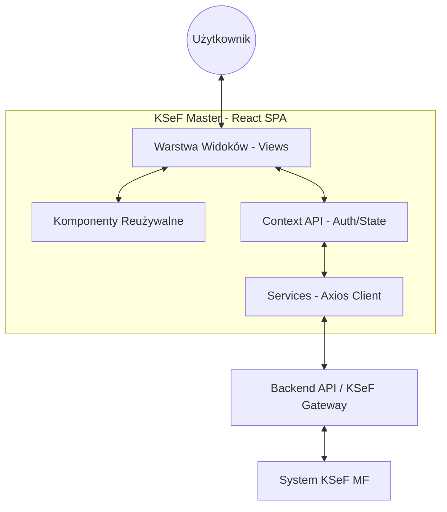

# Architektura Systemu

Ten dokument opisuje architekturę projektu KSeF Master, strukturę komponentów oraz przepływ danych.

## Ogólna Architektura

KSeF Master to aplikacja frontendowa typu Single Page Application (SPA) zbudowana w oparciu o framework **React** i narzędzie **Vite**. Aplikacja komunikuje się z dedykowanym backendem (KSeF API Gateway) poprzez interfejs REST API.

## Główne Komponenty

Projekt jest podzielony na kilka kluczowych obszarów:

1.  **Views (Widoki)**: Kompletne strony aplikacji (np. Dashboard, Lista Faktur, Nowa Faktura). Znajdują się w `src/views/`.
2.  **Components (Komponenty)**: Reużywalne elementy UI (przyciski, inputy, modale, nawigacja). Znajdują się w `src/components/`.
3.  **Services (Usługi)**: Logika komunikacji z API. Głównym serwisem jest `ksefApi.ts`, który enkapsuluje wywołania do backendu.
4.  **Context (Kontekst)**: Zarządzanie globalnym stanem aplikacji, w szczególności uwierzytelnianiem (`AuthContext.tsx`).
5.  **Helpers (Pomocnicy)**: Funkcje pomocnicze do formatowania walut, walidacji NIP, czy operacji na danych faktur.

## Przepływ Danych (Data Flow)

### Autoryzacja
1. Użytkownik wprowadza NIP i Token KSeF w `StartView`.
2. `AuthContext` wywołuje funkcję `login` z `ksefApi.ts`.
3. Po poprawnym zalogowaniu, sesja jest utrzymywana w backendzie, a frontend przechowuje stan `isAuthenticated`.
4. Wszystkie kolejne zapytania API są autoryzowane na podstawie sesji (cookie lub token przekazywany przez backend).

### Obsługa Faktur
1. Widok (np. `NewInvoice`) zbiera dane od użytkownika.
2. Dane są walidowane lokalnie przy użyciu helperów.
3. Wywoływana jest usługa `sendInvoice`, która wysyła obiekt JSON do backendu.
4. Backend przekształca dane na format XML zgodny ze schemą KSeF i przesyła do Ministerstwa Finansów.

## Decyzje Architektoniczne

-   **React Context vs Redux**: Zdecydowano się na React Context ze względu na prostotę i wystarczalność dla obecnych potrzeb zarządzania stanem (głównie autoryzacja).
-   **TypeScript**: Cały projekt jest napisany w TypeScript, co zapewnia bezpieczeństwo typów przy skomplikowanych strukturach faktur KSeF.
-   **CSS Modules/Scoped CSS**: Każdy widok/komponent posiada własny plik CSS, co zapobiega konfliktom stylów.
-   **Axios**: Użyty do komunikacji HTTP ze względu na łatwość obsługi interceptorów i automatyczną transformację JSON.

---
[Poprzedni: Instalacja](INSTALLATION.md) | [Następny: API](API.md)
